# Architecture Document

## Kai Quality Sandbox — System Architecture

---

## 1. High-Level Architecture

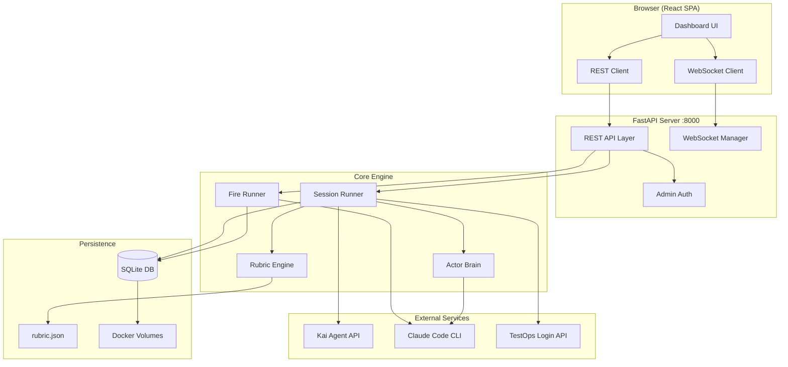

---

## 2. Component Architecture

### 2.1 System Layers

```mermaid
graph LR
    subgraph Presentation["Presentation Layer"]
        direction TB
        R1[SessionLauncher]
        R2[SessionDetail]
        R3[MatchList / MatchReport]
        R4[MatchTrends / Reports]
        R5[RubricSettings]
        R6[EnvironmentSettings]
    end

    subgraph API["API Layer (FastAPI)"]
        direction TB
        A1[Session Endpoints]
        A2[Match Endpoints]
        A3[Config Endpoints]
        A4[Report Endpoints]
        A5[WebSocket Endpoints]
    end

    subgraph Business["Business Logic"]
        direction TB
        B1[Session Runner]
        B2[Fire Runner]
        B3[Actor Brain]
        B4[Rubric Engine]
        B5[Env Config Manager]
    end

    subgraph Data["Data Layer"]
        direction TB
        D1[Database CRUD]
        D2[Token Cache]
        D3[Rubric Storage]
    end

    Presentation --> API --> Business --> Data
```

### 2.2 Backend Components

| Component | File | Responsibility |
|-----------|------|----------------|
| **REST API** | `server.py` | HTTP endpoints, request validation, admin auth |
| **WebSocket Manager** | `server.py` | Real-time event broadcasting to connected clients |
| **Session Runner** | `session_runner.py` | Orchestrates test sessions: message flow, evaluation, DB writes |
| **Fire Runner** | `fire_runner.py` | Autonomous Claude Code sessions for fire mode |
| **Actor Brain** | `actor_brain.py` | Claude CLI wrapper for message decisions and evaluations |
| **Rubric Engine** | `rubric.py` | Scoring criteria, latency thresholds, weight management |
| **Env Config** | `env_config.py` | Multi-environment credential and URL management |
| **Database** | `database.py` | SQLite CRUD operations, schema migrations |
| **Kai Client** | `kai_client.py` | Kai API protocol implementation (CopilotKit polling) |
| **Kai Actor** | `kai_actor.py` | Predefined test scenario definitions |

### 2.3 Frontend Components

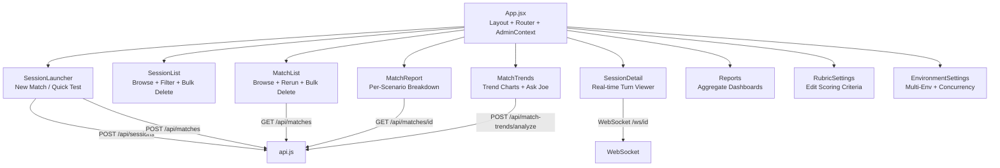

---

## 3. Data Architecture

### 3.1 Entity Relationship

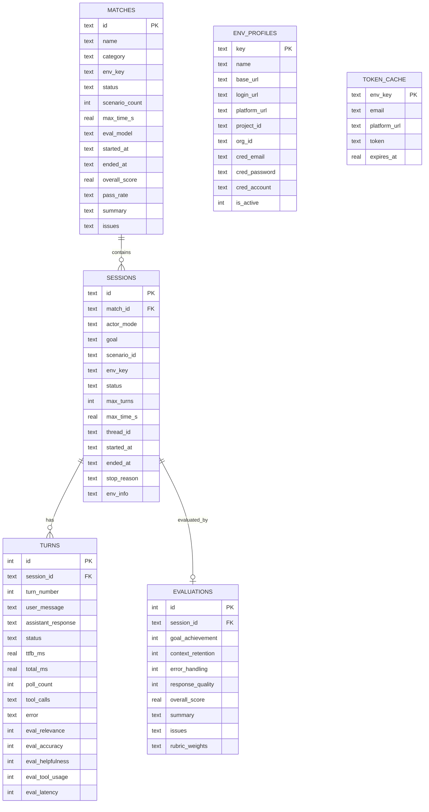

### 3.2 Database Configuration

| Setting | Value |
|---------|-------|
| Engine | SQLite 3 |
| WAL Mode | Enabled (concurrent reads during writes) |
| Foreign Keys | Enabled |
| Location | `web/data/kai_tests.db` |
| Persistence | Docker volume `kai-data` |
| Migrations | Auto-applied on startup (ALTER TABLE IF NOT EXISTS) |

---

## 4. Kai API Protocol

Kai uses a CopilotKit-based two-endpoint polling protocol (no SSE streaming):

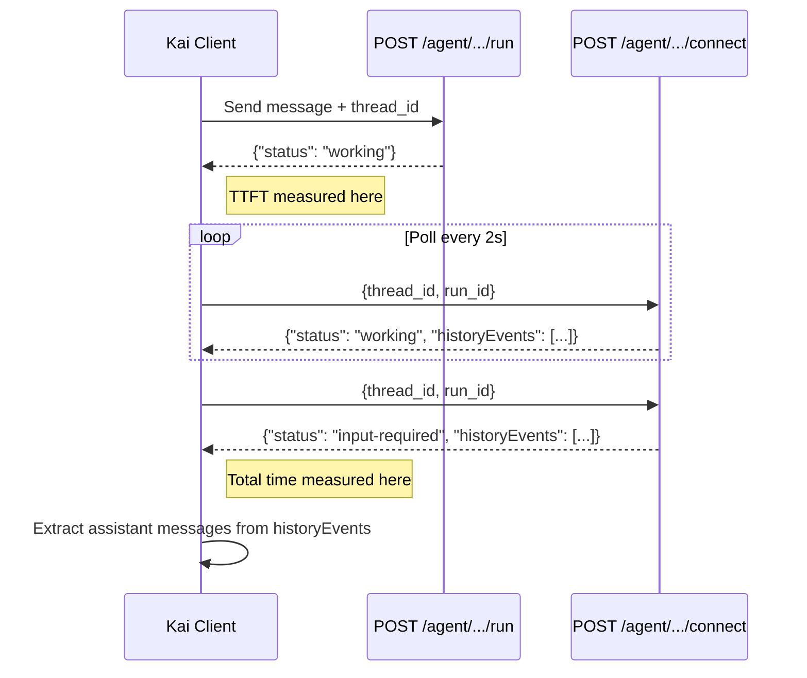

### Key Protocol Details

- **No partial content**: During `working` status, `historyEvents` may be incomplete
- **TTFT**: Measured when `/run` returns (API acceptance time, not first content)
- **Total**: Measured when final `/connect` returns `input-required`
- **Thread ID**: Maintained across turns for multi-turn context
- **Tool calls**: Extracted from `historyEvents` entries with `role: "tool"` or `toolCalls` array
- **Response concatenation**: All assistant messages concatenated (forward order) from `historyEvents`

### Authentication Chain

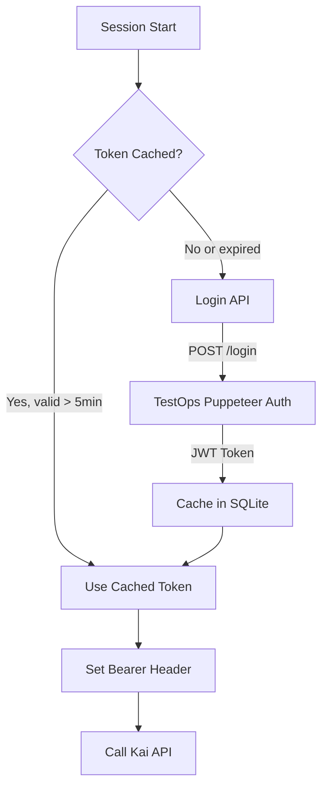

---

## 5. Session Execution Flow

### 5.1 Standard Modes (Fixed/Explore/Hybrid)

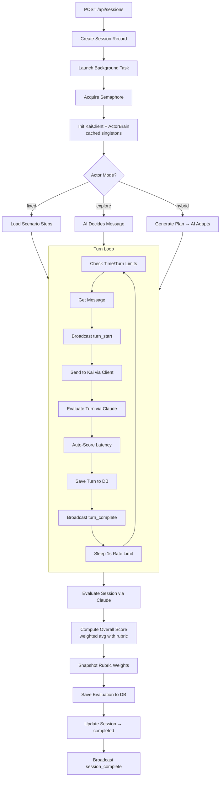

### 5.2 Fire Mode

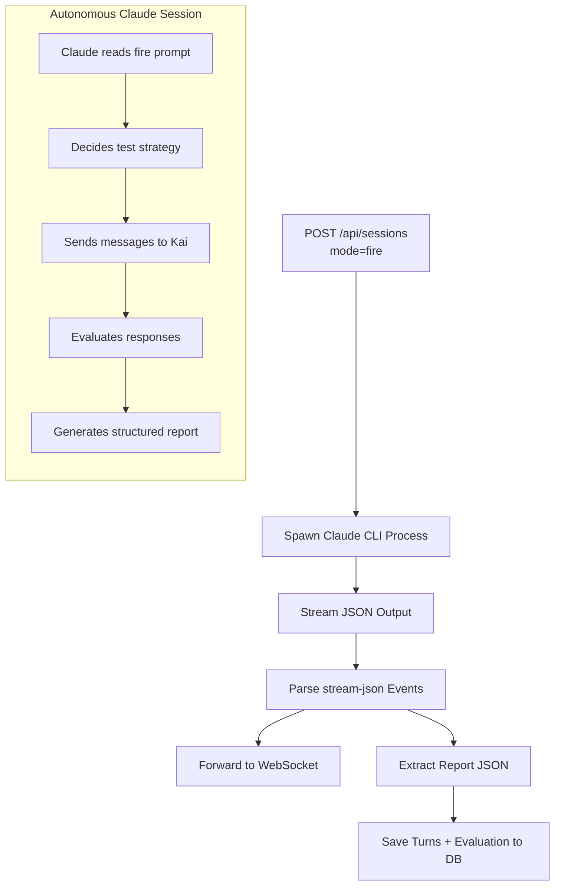

### 5.3 Match Execution

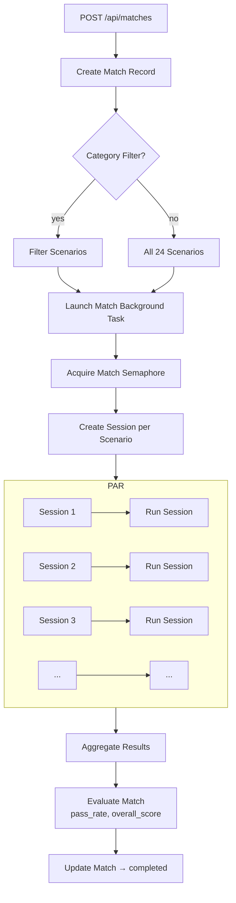

---

## 6. Evaluation Architecture

### 6.1 Scoring Pipeline

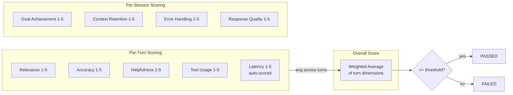

### 6.2 Latency Thresholds (Default)

| Score | TTFT (ms) | Total (ms) | Description |
|-------|-----------|------------|-------------|
| 5 | <= 3,000 | <= 15,000 | Excellent |
| 4 | <= 6,000 | <= 30,000 | Good |
| 3 | <= 10,000 | <= 60,000 | Acceptable |
| 2 | <= 20,000 | <= 120,000 | Slow |
| 1 | > 20,000 | > 120,000 | Unacceptable |

### 6.3 Rubric Weight Snapshot

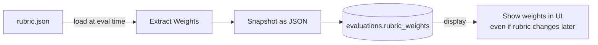

---

## 7. Concurrency Model

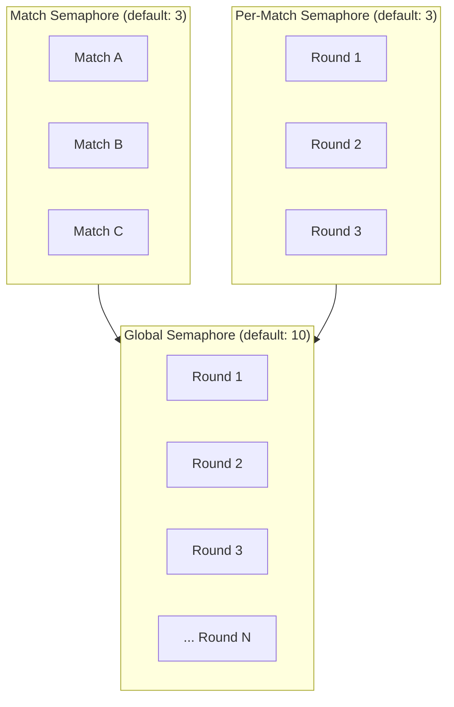

| Layer | Default | Controls |
|-------|---------|----------|
| **Global Rounds** | 10 | Total concurrent sessions across entire system |
| **Concurrent Matches** | 3 | How many matches can run simultaneously |
| **Rounds per Match** | 3 | How many sessions within one match run in parallel |

All configurable via admin API (`PUT /api/config`).

---

## 8. Real-Time Communication

### 8.1 WebSocket Architecture

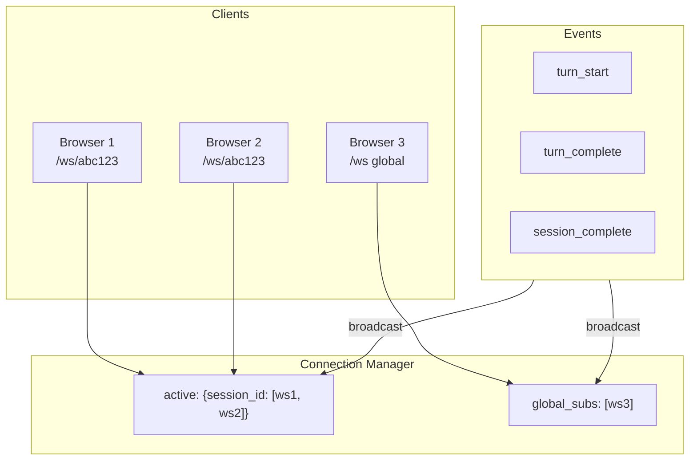

### 8.2 Event Payloads

**turn_start:**
```json
{"type": "turn_start", "turn_number": 1, "user_message": "Hello!"}
```

**turn_complete:**
```json
{
  "type": "turn_complete",
  "turn_number": 1,
  "user_message": "Hello!",
  "assistant_response": "Hi! I'm Kai...",
  "status": "input-required",
  "ttfb_ms": 3251.2,
  "total_ms": 52100.0,
  "poll_count": 8,
  "tool_calls": ["frontend_render_link"],
  "eval": {"relevance": 5, "accuracy": 5, "helpfulness": 4, "tool_usage": 5},
  "eval_latency": 3
}
```

**session_complete:**
```json
{
  "type": "session_complete",
  "session_id": "abc123",
  "evaluation": {"goal_achievement": 5, "context_retention": 4, ...},
  "turns_completed": 1
}
```

---

## 9. Environment Configuration

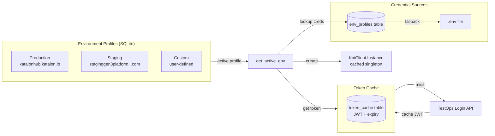

---

## 10. Deployment Architecture

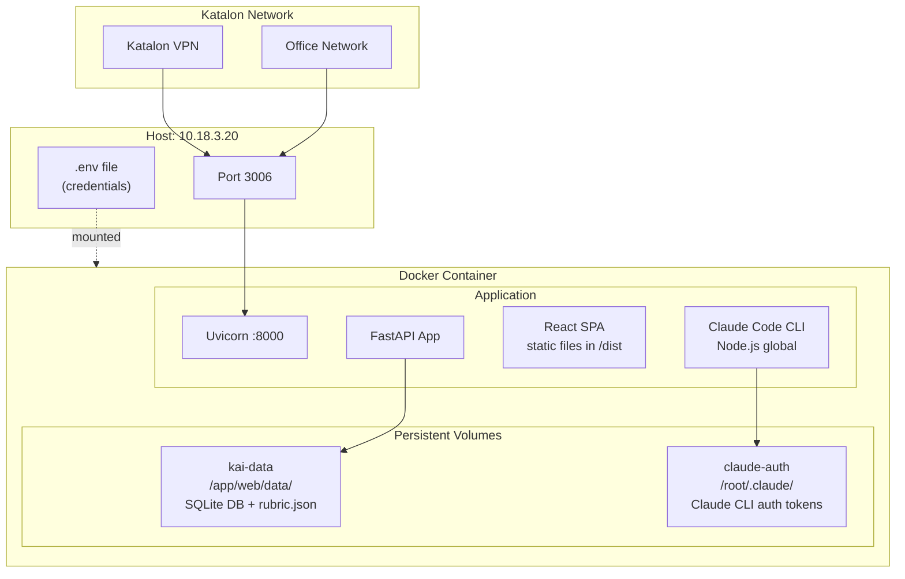

### 10.1 Dockerfile (Multi-Stage)

```
Stage 1: frontend-build (node:20-slim)
  ├── npm ci
  └── npm run build → /app/web/frontend/dist

Stage 2: runtime (python:3.11-slim)
  ├── Install Node.js 20 (for Claude CLI)
  ├── npm install -g @anthropic-ai/claude-code
  ├── pip install -r requirements.txt
  ├── Copy scripts/, web/, frontend dist
  └── Entrypoint: uvicorn server:app
```

### 10.2 Deploy Commands

```bash
# Build + deploy
cd /Users/chau.duong/workspaces/test-kai
rsync -avz --exclude '.git' --exclude 'node_modules' --exclude '.env' \
  . katalon@10.18.3.20:/home/katalon/test-kai/
ssh katalon@10.18.3.20 "cd /home/katalon/test-kai && docker compose up --build -d"

# Verify
curl http://10.18.3.20:3006/api/health
```

---

## 11. Security

| Concern | Implementation |
|---------|---------------|
| **Admin Auth** | HMAC-SHA256 token, 7-day TTL, required for destructive ops |
| **Credential Storage** | SQLite (server-only), passwords never sent to frontend |
| **API Auth** | Bearer JWT cached in SQLite, auto-refreshed on expiry |
| **Network Access** | Katalon VPN or office network only (no public exposure) |
| **Secrets** | `.env` file, never committed, mounted read-only in Docker |
| **XSS Prevention** | React auto-escaping, no `dangerouslySetInnerHTML` |
| **SQL Injection** | Parameterized queries throughout |

---

## 12. Performance Optimizations

| Optimization | Impact |
|-------------|--------|
| **KaiClient singleton** | Avoids re-auth per session (saves 5-10s login) |
| **Token cache (SQLite)** | Bearer JWT reused across container restarts |
| **ActorBrain singleton** | `claude --version` check runs once, not per session |
| **SQLite WAL mode** | Concurrent reads during writes |
| **Per-match semaphore** | Parallel session execution within matches |
| **WebSocket broadcasting** | Efficient real-time updates (no polling) |
| **Rubric weight snapshot** | Avoids re-computation when rubric changes |

---

## 13. API Reference

### Sessions

| Method | Endpoint | Auth | Description |
|--------|----------|------|-------------|
| POST | `/api/sessions` | - | Start a new test session |
| GET | `/api/sessions` | - | List sessions (paginated) |
| GET | `/api/sessions/{id}` | - | Get session with turns + evaluation |
| DELETE | `/api/sessions/{id}` | Admin | Delete session (not running) |
| POST | `/api/sessions/bulk-delete` | Admin | Bulk delete sessions |

### Matches

| Method | Endpoint | Auth | Description |
|--------|----------|------|-------------|
| POST | `/api/matches` | - | Create match (batch test) |
| GET | `/api/matches` | - | List matches |
| GET | `/api/matches/{id}` | - | Match report with scenario breakdown |
| DELETE | `/api/matches/{id}` | Admin | Delete match + cascade |
| POST | `/api/matches/bulk-delete` | Admin | Bulk delete matches |

### Configuration

| Method | Endpoint | Auth | Description |
|--------|----------|------|-------------|
| GET | `/api/config` | - | Get config (concurrency, model, CLI status) |
| PUT | `/api/config` | Admin | Update config |
| GET | `/api/scenarios` | - | List predefined test scenarios |
| GET | `/api/rubric` | - | Get current rubric |
| PUT | `/api/rubric` | Admin | Update rubric |
| POST | `/api/rubric/reset` | Admin | Reset rubric to defaults |

### Environment

| Method | Endpoint | Auth | Description |
|--------|----------|------|-------------|
| GET | `/api/env-config` | - | Get environments (passwords masked) |
| PUT | `/api/env-config` | Admin | Update environments |
| DELETE | `/api/env-config/{key}` | Admin | Delete environment profile |
| POST | `/api/env-config/reset` | Admin | Reset to defaults |
| GET | `/api/env-config/{key}/health` | - | Health check for environment |

### Reports & Analytics

| Method | Endpoint | Auth | Description |
|--------|----------|------|-------------|
| GET | `/api/reports` | - | Aggregate stats (filter by ring) |
| GET | `/api/match-trends` | - | Historical match trends |
| POST | `/api/match-trends/analyze` | - | AI quality analysis (Ask Joe) |
| GET | `/api/health` | - | System health check |

### Auth & Bot

| Method | Endpoint | Auth | Description |
|--------|----------|------|-------------|
| POST | `/api/login` | - | Admin login |
| GET | `/api/me` | Bearer | Check auth status |
| GET | `/api/joe-bot/health` | - | Claude CLI availability |
| POST | `/api/joe-bot/auth/start` | - | Start Claude OAuth |
| POST | `/api/joe-bot/auth/complete` | - | Complete OAuth with code |

### WebSocket

| Endpoint | Description |
|----------|-------------|
| `/ws` | Global subscription (all session events) |
| `/ws/{session_id}` | Session-specific subscription |

---

## 14. Tech Stack Summary

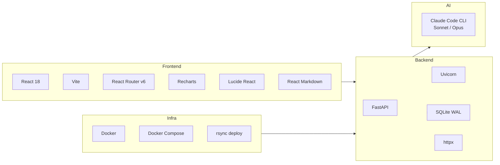

| Layer | Technology | Version |
|-------|-----------|---------|
| **Frontend** | React | 19.2 |
| **Bundler** | Vite | 7.3 |
| **Routing** | React Router | 7.13 |
| **Charts** | Recharts | 3.7 |
| **Icons** | Lucide React | 0.577 |
| **Markdown** | React Markdown | 10.1 |
| **Backend** | FastAPI | 0.115+ |
| **Server** | Uvicorn | 0.30+ |
| **HTTP Client** | httpx | 0.27+ |
| **Database** | SQLite | 3 (stdlib) |
| **AI Eval** | Claude Code CLI | latest |
| **Container** | Docker + Compose | latest |
| **Runtime** | Python 3.11, Node 20 | |
