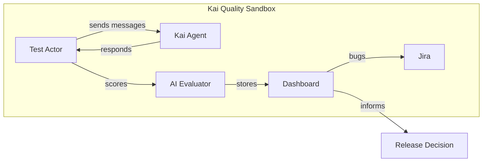
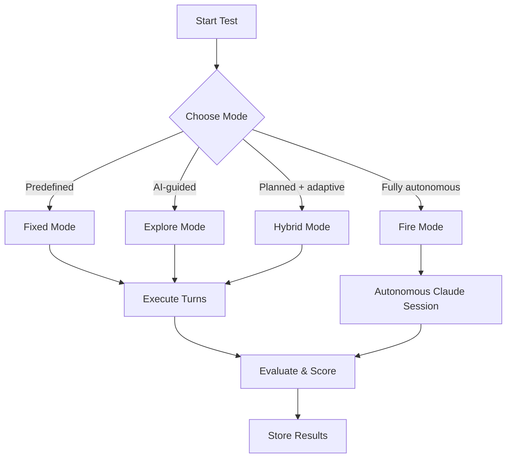
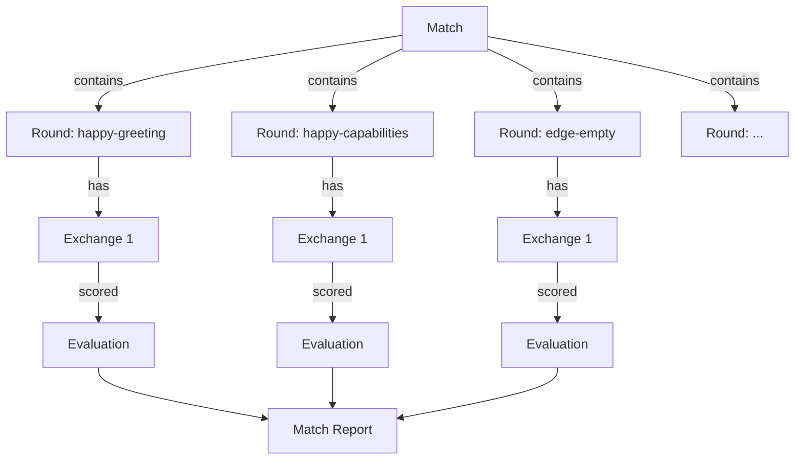
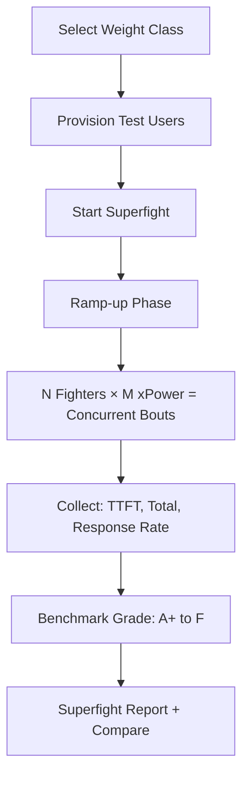
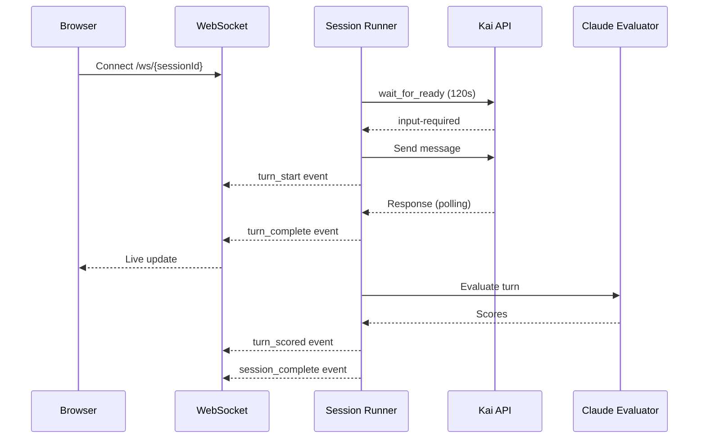
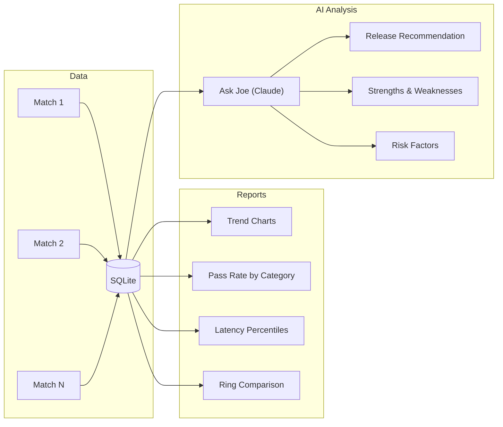

# Product Requirements Document (PRD)

## Kai Quality Sandbox — E2E Testing Platform for Katalon's AI Agent (v2.0)

| Field | Value |
|-------|-------|
| **Product** | Kai Quality Sandbox (Test-Kai) |
| **Owner** | Chau Duong (Joe) — QE Director, Katalon |
| **Status** | Live (v2.0) |
| **Server** | `10.18.3.20:3006` |
| **Stack** | FastAPI + React 18 + SQLite + Claude Code CLI |
| **Mission** | The goal isn't to destroy Kai — it's to make Kai undestroyable. |

---

## 1. Problem Statement

Katalon's Kai orchestrator agent is a customer-facing AI assistant embedded in the TestOps platform. Before each release, the team needs confidence that Kai:

- Responds accurately to testing-related questions
- Uses tools appropriately (requirements, test cases, insights)
- Maintains context across multi-turn conversations
- Handles edge cases and adversarial inputs gracefully
- Performs within acceptable latency bounds under both single-user and concurrent load

**There is no automated, repeatable way to measure Kai's quality across these dimensions.** Manual testing is slow, subjective, and doesn't produce actionable metrics. The team cannot make data-driven release decisions.

---

## 2. Solution Overview

A standalone testing platform that:

1. **Drives real conversations** with Kai using multiple test strategies (fixed, explore, hybrid, fire)
2. **Evaluates every exchange** with AI-powered scoring across 5 dimensions
3. **Load-tests under concurrency** with the Superfight system (multi-fighter, multi-window)
4. **Manages test scenarios** with full CRUD, user submissions, and admin review
5. **Integrates with Jira** for automated bug logging with duplicate detection
6. **Provides AI-powered insights** via Ask Joe chatbot and trend analysis
7. **Aggregates results** into dashboards with trends, pass rates, and latency metrics
8. **Delivers release recommendations** based on accumulated test data

---

## 3. Target Users

| User | Needs |
|------|-------|
| **QA Engineers** | Run regression suites, view per-scenario pass/fail, submit new scenarios |
| **Kai Developers** | Debug response quality, identify regressions, view Jira bugs |
| **Engineering Leads** | Release readiness assessment, quality trends, load test results |
| **Product Managers** | High-level quality metrics, category breakdown, GO/NO-GO recommendations |

---

## 4. Core Features

### 4.1 Multi-Mode Test Execution

| Mode | Description | Use Case |
|------|-------------|----------|
| **Fixed** | Predefined scenarios with exact messages | Regression testing, CI/CD gates |
| **Explore** | AI decides each message dynamically based on goal | Exploratory testing, edge discovery |
| **Hybrid** | AI generates a plan, adapts per exchange | Structured exploration |
| **Fire** | Fully autonomous Claude session drives entire test | Deep stress testing, creative probing |

### 4.2 Test Scenario Management

| Feature | Description |
|---------|-------------|
| **Builtin Scenarios** | 24+ predefined scenarios across 6 categories |
| **Custom Scenarios** | Admin CRUD: create, edit, clone, delete |
| **Builtin Editing** | Clone builtin → custom for modification; hide/unhide for soft-delete |
| **User Submissions** | Any user can submit scenarios for admin review |
| **Submission Review** | Admin approves (→ custom) or rejects (with reason) |
| **Category Filter** | Happy Path, Functional, Edge Cases, Multi-Turn, Stress, Guardrails |

**Scenario Categories:**

| Category | Count | Purpose |
|----------|-------|---------|
| **Happy Path** | 6 | Core capabilities: greeting, requirements, test cases, insights |
| **Functional** | 5 | Feature-specific: TestCloud, scheduling, environments, flakiness |
| **Edge Cases** | 6 | Empty input, long input, special chars, ambiguous, out-of-scope |
| **Multi-Turn** | 2 | Context retention across follow-ups |
| **Stress** | 2 | Rapid topic switching, deep conversations |
| **Guardrails** | 3 | Prompt injection, data leak, role escape resistance |
| **Custom** | N | User-created and approved submissions |

### 4.3 Match System

A **Match** is a batch of test sessions (rounds) executed together.

- **Quick Test**: One-click greeting test for smoke checks
- **Category Match**: Run all scenarios in a category
- **Full Match**: Run all scenarios (builtin + custom, excluding hidden)
- **Concurrency**: Configurable parallel execution (global, per-match, rounds-per-match)
- **Match History Cleanup**: Delete by date range, older-than (with custom day input), or bulk select
- **Confirmation Modals**: All destructive operations use proper modals with danger warnings

### 4.4 AI-Powered Evaluation

Every exchange is scored on 5 dimensions (1-5 scale):

| Dimension | Weight | Scoring Method |
|-----------|--------|----------------|
| **Relevance** | Configurable | Claude AI evaluation |
| **Accuracy** | Configurable | Claude AI evaluation |
| **Helpfulness** | Configurable | Claude AI evaluation |
| **Tool Usage** | Configurable | Claude AI evaluation |
| **Latency** | Configurable | Auto-scored from thresholds |

Session-level evaluation adds 4 more dimensions:

| Dimension | Weight | Description |
|-----------|--------|-------------|
| **Goal Achievement** | 1.5x | Did Kai accomplish the test objective? |
| **Context Retention** | 1.0x | Did Kai maintain context across turns? |
| **Error Handling** | 1.0x | How did Kai handle edge cases? |
| **Response Quality** | 1.0x | Overall quality of responses |

**Overall Score** = weighted average of all turn dimensions, using configurable rubric weights snapshotted at evaluation time.

**Pass/Fail** = overall score >= configurable threshold (default 3.0/5.0)

### 4.5 Configurable Rubric

Admins can customize:

- **Dimension weights** (e.g., latency 4x, accuracy 1x)
- **Score descriptions** (what constitutes a 1, 2, 3, 4, 5 for each dimension)
- **Latency thresholds** (e.g., total <=15s = 5/5, <=30s = 4/5, ...)
- **Pass threshold** (minimum score to "pass")

Rubric weights are **snapshotted** when evaluation runs, so changing settings doesn't affect past scores.

### 4.6 Superfight — Load Testing System

| Weight Class | Fighters | xPower | Total Bouts | Purpose |
|-------------|----------|--------|-------------|---------|
| Flyweight | 2-4 | 1-2 | 2-8 | Quick load smoke test |
| Bantamweight | 5-8 | 2 | 10-16 | Light concurrency |
| Middleweight | 10-15 | 2-3 | 20-45 | Moderate load |
| Heavyweight | 20-30 | 3-4 | 60-120 | Heavy load |
| Superfight | 50+ | 4+ | 200+ | Maximum stress |

**Features:**
- User provisioning/teardown via Katalon Platform API
- Weight class framework with configurable fighter count and xPower
- Live benchmark scoring during execution
- Historical comparison across superfights
- Metrics: TTFT p50/p95/max, total p50/p95/max, response rate, completion rate, error rate

### 4.7 Ask Joe — AI Chatbot

An in-app AI assistant powered by Claude Code CLI that helps users navigate the platform.

| Capability | Description |
|-----------|-------------|
| **Tool guidance** | Explains fight modes, scenarios, scoring, settings |
| **Scenario knowledge** | Reads scenarios from DB, suggests which to run |
| **Match execution** | Can launch matches with user confirmation via action cards |
| **Markdown rendering** | Rich responses with bold, italic, code blocks, lists |
| **Author info** | Shares Joe's vision and the platform's purpose |
| **Security** | Read-only, refuses exploits/injection/code generation |

**About Joe:**
> Built by Joe (Chau Duong), Katalon Quality Engineering Director. Built with caffeine, Claude Code, and an unhealthy obsession with latency percentiles. The goal isn't to destroy Kai — it's to make Kai undestroyable.

### 4.8 Jira Integration

| Feature | Description |
|---------|-------------|
| **Per-turn bug logging** | Admin can log a bug for any individual exchange |
| **Session-level bug logging** | Log all turns as a single Jira issue |
| **Auto-logging** | Automatically logs bugs when quality thresholds are met |
| **Duplicate detection** | JQL search + Claude AI analysis prevents duplicates |
| **Assignee routing** | Keyword-based rules assign to appropriate team members |
| **Connection test** | Admin can verify Jira connectivity from settings UI |
| **Ticket tracking** | Linked tickets shown in session detail and round list |

### 4.9 Real-Time Monitoring

- WebSocket live updates (turn-by-turn, with separate score events)
- Latency tracking (TTFT, total response time)
- Tool call logging
- Auto-scroll to latest turn
- Turn sequencing: wait_for_ready prevents overlapping requests

### 4.10 Multi-Environment Support

Test against different Kai deployments:

| Environment | URL | Use Case |
|-------------|-----|----------|
| **Production** | `katalonhub.katalon.io` | Release validation |
| **Staging** | `staginggen3platform.staging.katalon.com` | Pre-release testing |
| **Custom** | User-defined | Feature branch testing |

Each environment has independent credentials, project context, and health checks.

### 4.11 Analytics & Trends

- **Trend Charts**: Score and pass rate over time
- **Category Breakdown**: Per-category pass rates and scores
- **Latency Analysis**: Avg, p50, p95, max TTFT and total
- **Ring Comparison**: Side-by-side production vs staging
- **Ask Joe AI Analysis**: Deep quality assessment with GO/NO-GO/CONDITIONAL release recommendation

### 4.12 Notification System

| Feature | Description |
|---------|-------------|
| **Feature announcements** | Auto-seeded on startup for new capabilities |
| **Scenario notifications** | Alerts when submissions are approved/rejected |
| **Deep links** | "View" links navigate to correct pages (scenarios, pool, manual) |
| **Admin management** | Create, list, delete notifications |

### 4.13 Feedback System

| Feature | Description |
|---------|-------------|
| **User feedback** | Submit bugs, feature requests, general feedback, praise |
| **No auth required** | Anyone can submit feedback |
| **Admin view** | Browse and manage all feedback |

### 4.14 Admin Controls

| Control | Default | Description |
|---------|---------|-------------|
| Max Concurrent Rounds (Global) | 10 | Total parallel sessions across all matches |
| Max Concurrent Matches | 3 | Parallel matches |
| Max Rounds per Match | 3 | Parallel sessions within a single match |
| Eval Model | Sonnet | Claude model for evaluation (Haiku/Sonnet/Opus) |
| Match History Cleanup | - | Delete by date range or older-than with custom days |
| Confirmation Modals | - | All destructive ops use modals with warnings |

Admin authentication required for: delete operations, config changes, rubric edits, environment management, scenario CRUD, Jira config, notification management.

### 4.15 Fight Manual (Guideline)

In-app documentation covering:

- Boxing terminology mapping (Match → Bout, Round → Round, Exchange → Punch)
- Fight mode explanations (Fixed, Explore, Hybrid, Fire)
- Scoring system reference
- Latency grading thresholds
- Load test terminology (Superfight, Fighter, xPower)

---

## 5. Non-Functional Requirements

| Requirement | Target |
|-------------|--------|
| **Availability** | Internal tool, best-effort uptime |
| **Data Persistence** | SQLite with Docker volume (survives container restarts) |
| **Concurrent Users** | 5-10 simultaneous dashboard viewers |
| **Session Startup** | < 1s (after first init) |
| **Evaluation Latency** | ~5-10s per turn (Claude CLI) |
| **Access Control** | Katalon VPN or office network required |
| **Load Test Capacity** | Up to 200+ concurrent bouts (Superfight) |
| **Jira Integration** | Auto-log bugs with duplicate detection |
| **UX** | All destructive operations confirmed via modals, no browser alerts |

---

## 6. Success Metrics

| Metric | Target |
|--------|--------|
| Test execution coverage | All scenarios pass in both production and staging |
| Quality score trend | Upward or stable across releases |
| Pass rate | >= 80% across all categories |
| Latency score | Average >= 3.0/5.0 |
| Load test benchmark | >= Grade B under moderate concurrency |
| Release decision confidence | Team uses dashboard data to approve/block releases |
| Bug detection rate | Auto-log catches quality regressions before release |

---

## 7. Risks & Mitigations

| Risk | Impact | Mitigation |
|------|--------|------------|
| Claude CLI unavailable in Docker | No evaluation | Health check endpoint, auth persistence via volume |
| Kai API changes break client | Tests fail | Protocol abstracted in kai_client.py, easy to update |
| Token expiry during long match | Mid-match failures | SQLite token cache with JWT expiry detection |
| Single account for testing | Rate limiting | Configurable concurrency limits, multi-user provisioning |
| Rubric subjectivity | Inconsistent scores | Snapshotted weights, explicit score descriptions |
| Turn overlap during slow Kai responses | Corrupted conversations | Three-layer turn sequencing: wait_for_ready + poll + verify |
| Jira duplicate bugs | Noise | JQL + Claude AI duplicate detection |
| Chatbot exploitation | Security risk | Read-only, hardened against injection/exploits |

---

## 8. Roadmap

| Phase | Features | Status |
|-------|----------|--------|
| **v1.0** | Core testing, evaluation, dashboard, multi-env | Done |
| **v1.1** | Ask Joe trend analysis, configurable rubric, concurrency controls | Done |
| **v1.2** | Superfight load testing, user provisioning, benchmarking | Done |
| **v1.3** | Jira integration, auto-bug logging, duplicate detection | Done |
| **v2.0** | Scenario CRUD, submissions, Ask Joe chatbot, notifications, feedback, confirmation modals, turn sequencing, match cleanup, Fight Manual | Done |
| **v2.1** | CI/CD integration, scheduled matches, Slack notifications | Planned |
| **v2.2** | A/B environment comparison, scenario analytics | Planned |
| **v3.0** | TestOps integration, release gate automation, multi-tenant | Planned |
