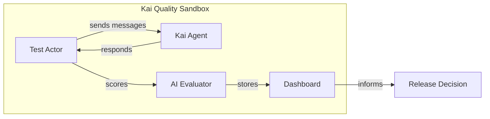
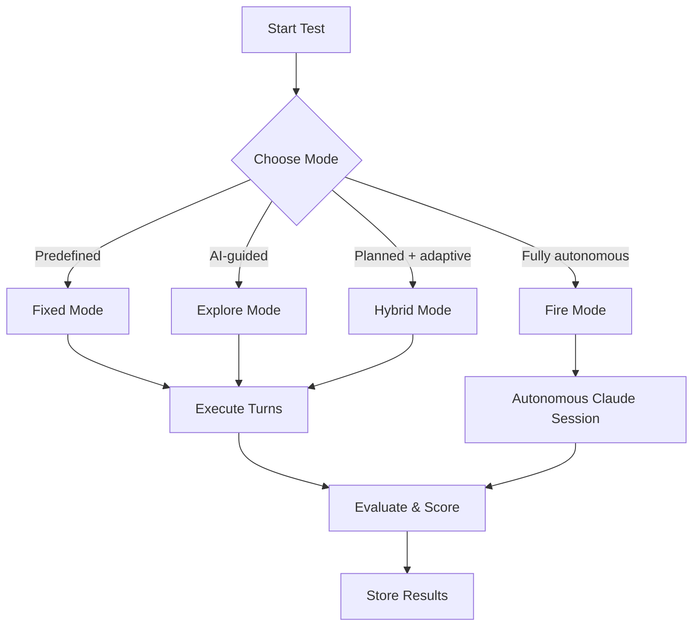
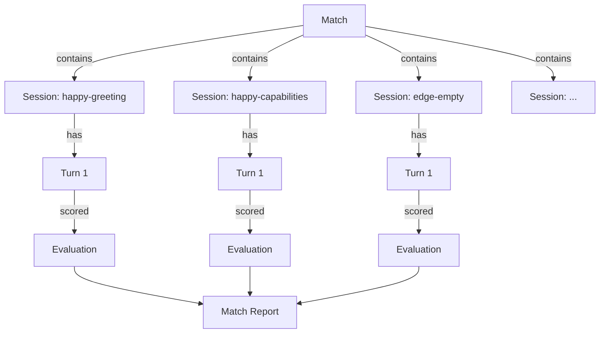
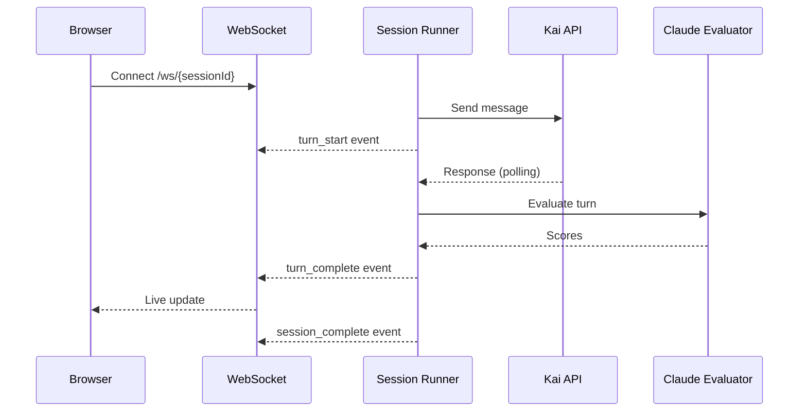
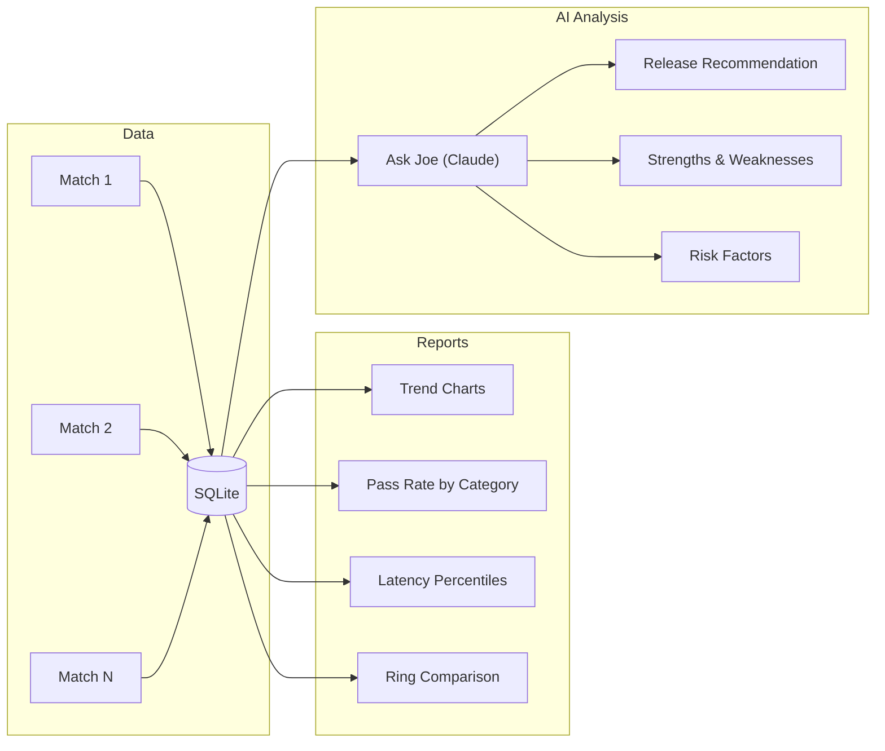

# Product Requirements Document (PRD)

## Kai Quality Sandbox — E2E Testing Platform for Katalon's AI Agent

| Field | Value |
|-------|-------|
| **Product** | Kai Quality Sandbox (Test-Kai) |
| **Owner** | Chau Duong |
| **Status** | Live (v1.0) |
| **Server** | `10.18.3.20:3006` |
| **Stack** | FastAPI + React 18 + SQLite + Claude Code CLI |

---

## 1. Problem Statement

Katalon's Kai orchestrator agent is a customer-facing AI assistant embedded in the TestOps platform. Before each release, the team needs confidence that Kai:

- Responds accurately to testing-related questions
- Uses tools appropriately (requirements, test cases, insights)
- Maintains context across multi-turn conversations
- Handles edge cases and adversarial inputs gracefully
- Performs within acceptable latency bounds

**There is no automated, repeatable way to measure Kai's quality across these dimensions.** Manual testing is slow, subjective, and doesn't produce actionable metrics. The team cannot make data-driven release decisions.

---

## 2. Solution Overview

A standalone testing platform that:

1. **Drives real conversations** with Kai using multiple test strategies
2. **Evaluates every exchange** with AI-powered scoring across 5 dimensions
3. **Aggregates results** into dashboards with trends, pass rates, and latency metrics
4. **Provides AI-generated release recommendations** based on accumulated test data

---

## 3. Target Users

| User | Needs |
|------|-------|
| **QA Engineers** | Run regression suites, view per-scenario pass/fail |
| **Kai Developers** | Debug response quality, identify regressions |
| **Engineering Leads** | Release readiness assessment, quality trends |
| **Product Managers** | High-level quality metrics, category breakdown |

---

## 4. Core Features

### 4.1 Multi-Mode Test Execution

| Mode | Description | Use Case |
|------|-------------|----------|
| **Fixed** | Predefined scenarios with exact messages | Regression testing, CI/CD gates |
| **Explore** | AI decides each message dynamically based on goal | Exploratory testing, edge discovery |
| **Hybrid** | AI generates a plan, adapts per exchange | Structured exploration |
| **Fire** | Fully autonomous Claude session drives entire test | Deep stress testing, creative probing |

### 4.2 Predefined Test Scenarios (24 total)

| Category | Count | Purpose |
|----------|-------|---------|
| **Happy Path** | 6 | Core capabilities: greeting, requirements, test cases, insights |
| **Functional** | 5 | Feature-specific: TestCloud, scheduling, environments, flakiness |
| **Edge Cases** | 6 | Empty input, long input, special chars, ambiguous, out-of-scope |
| **Multi-Turn** | 2 | Context retention across follow-ups |
| **Stress** | 2 | Rapid topic switching, deep conversations |
| **Guardrails** | 3 | Prompt injection, data leak, role escape resistance |

### 4.3 Match System

A **Match** is a batch of test sessions (rounds) executed together.

- **Quick Test**: One-click greeting test for smoke checks
- **Category Match**: Run all scenarios in a category (e.g., "happy path")
- **Full Match**: Run all 24 scenarios
- **Concurrency**: Configurable parallel execution (global, per-match, rounds-per-match)

### 4.4 AI-Powered Evaluation

Every exchange is scored on 5 dimensions (1-5 scale):

| Dimension | Weight | Scoring Method |
|-----------|--------|----------------|
| **Relevance** | Configurable | Claude AI evaluation |
| **Accuracy** | Configurable | Claude AI evaluation |
| **Helpfulness** | Configurable | Claude AI evaluation |
| **Tool Usage** | Configurable | Claude AI evaluation |
| **Latency** | Configurable | Auto-scored from thresholds |

Session-level evaluation adds 4 more dimensions:

| Dimension | Weight | Description |
|-----------|--------|-------------|
| **Goal Achievement** | 1.5x | Did Kai accomplish the test objective? |
| **Context Retention** | 1.0x | Did Kai maintain context across turns? |
| **Error Handling** | 1.0x | How did Kai handle edge cases? |
| **Response Quality** | 1.0x | Overall quality of responses |

**Overall Score** = weighted average of all turn dimensions, using configurable rubric weights snapshotted at evaluation time.

**Pass/Fail** = overall score >= configurable threshold (default 3.0/5.0)

### 4.5 Configurable Rubric

Admins can customize:

- **Dimension weights** (e.g., latency 4x, accuracy 1x)
- **Score descriptions** (what constitutes a 1, 2, 3, 4, 5 for each dimension)
- **Latency thresholds** (e.g., total <=15s = 5/5, <=30s = 4/5, ...)
- **Pass threshold** (minimum score to "pass")

Rubric weights are **snapshotted** when evaluation runs, so changing settings doesn't affect past scores.

### 4.6 Real-Time Monitoring

- WebSocket live updates (turn-by-turn)
- Latency tracking (TTFT, total response time)
- Tool call logging
- Auto-scroll to latest turn

### 4.7 Multi-Environment Support

Test against different Kai deployments:

| Environment | URL | Use Case |
|-------------|-----|----------|
| **Production** | `katalonhub.katalon.io` | Release validation |
| **Staging** | `staginggen3platform.staging.katalon.com` | Pre-release testing |
| **Custom** | User-defined | Feature branch testing |

Each environment has independent credentials, project context, and health checks.

### 4.8 Analytics & Trends

- **Trend Charts**: Score and pass rate over time
- **Category Breakdown**: Per-category pass rates and scores
- **Latency Analysis**: Avg, p50, p95, max TTFT and total
- **Ring Comparison**: Side-by-side production vs staging
- **Ask Joe AI Analysis**: Deep quality assessment with GO/NO-GO/CONDITIONAL release recommendation

### 4.9 Admin Controls

| Control | Default | Description |
|---------|---------|-------------|
| Max Concurrent Rounds (Global) | 10 | Total parallel sessions across all matches |
| Max Concurrent Matches | 3 | Parallel matches |
| Max Rounds per Match | 3 | Parallel sessions within a single match |
| Eval Model | Sonnet | Claude model for evaluation (Sonnet/Opus) |

Admin authentication required for: delete operations, config changes, rubric edits, environment management.

---

## 5. Non-Functional Requirements

| Requirement | Target |
|-------------|--------|
| **Availability** | Internal tool, best-effort uptime |
| **Data Persistence** | SQLite with Docker volume (survives container restarts) |
| **Concurrent Users** | 5-10 simultaneous dashboard viewers |
| **Session Startup** | < 1s (after first init) |
| **Evaluation Latency** | ~5-10s per turn (Claude CLI) |
| **Access Control** | Katalon VPN or office network required |

---

## 6. Success Metrics

| Metric | Target |
|--------|--------|
| Test execution coverage | All 24 scenarios pass in both production and staging |
| Quality score trend | Upward or stable across releases |
| Pass rate | >= 80% across all categories |
| Latency score | Average >= 3.0/5.0 |
| Release decision confidence | Team uses dashboard data to approve/block releases |

---

## 7. Risks & Mitigations

| Risk | Impact | Mitigation |
|------|--------|------------|
| Claude CLI unavailable in Docker | No evaluation | Health check endpoint, auth persistence via volume |
| Kai API changes break client | Tests fail | Protocol abstracted in kai_client.py, easy to update |
| Token expiry during long match | Mid-match failures | SQLite token cache with JWT expiry detection |
| Single account for testing | Rate limiting | Configurable concurrency limits |
| Rubric subjectivity | Inconsistent scores | Snapshotted weights, explicit score descriptions |

---

## 8. Roadmap

| Phase | Features | Status |
|-------|----------|--------|
| **v1.0** | Core testing, evaluation, dashboard, multi-env | Done |
| **v1.1** | Ask Joe analysis, configurable rubric, concurrency controls | Done |
| **v1.2** | CI/CD integration, scheduled matches, Slack notifications | Planned |
| **v1.3** | Multi-account testing, A/B comparison, custom scenarios UI | Planned |
| **v2.0** | TestOps integration, release gate automation | Planned |
